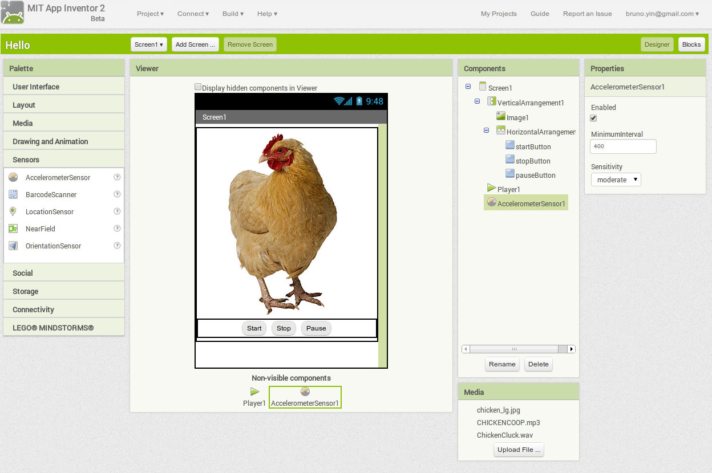
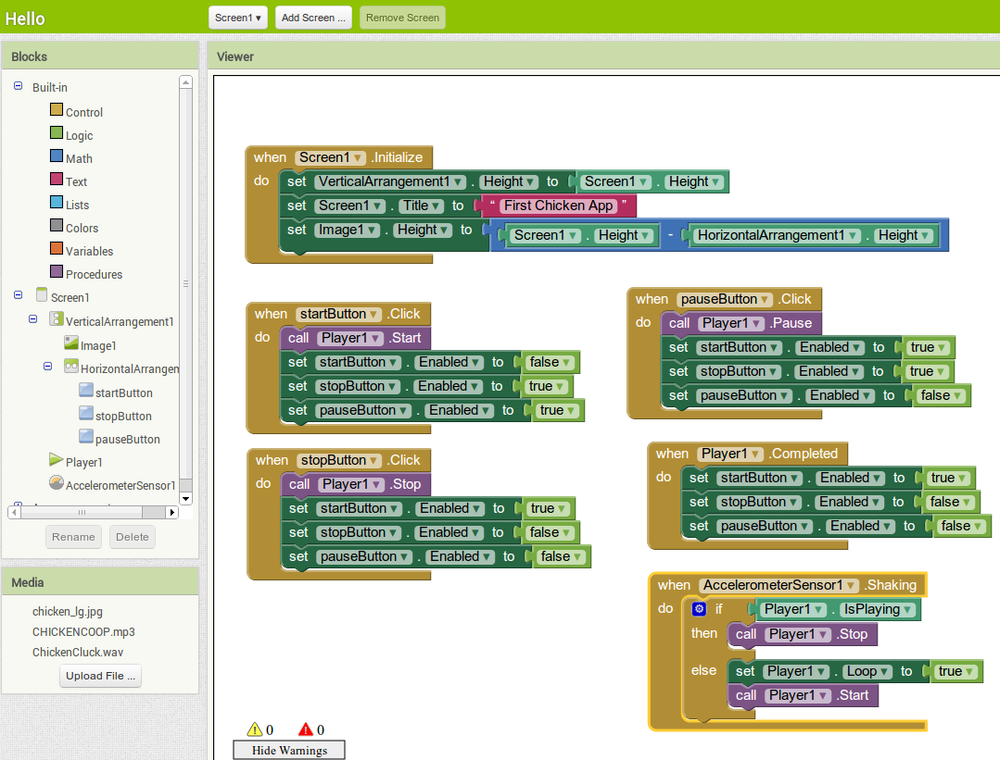

##Use MIT AppInvenor to create your first application

###required skills

1. layout
2. Media player
3. Accelerometer Sensor
4. image

###Minimum features:

1. display an image of an animal
2. when you shake the device, it starts to playing a sound or stops playing
3. optional: adjust image size to fill in the screen
4. optional: add buttons
5. optional: add images to the buttons

###Hints

1. 
2. 

##Resources:
1. multimedia files under assets if you do not have yours
2. [MIT AppIventor tutorials](http://appinventor.mit.edu/explore/ai2/tutorials?)

