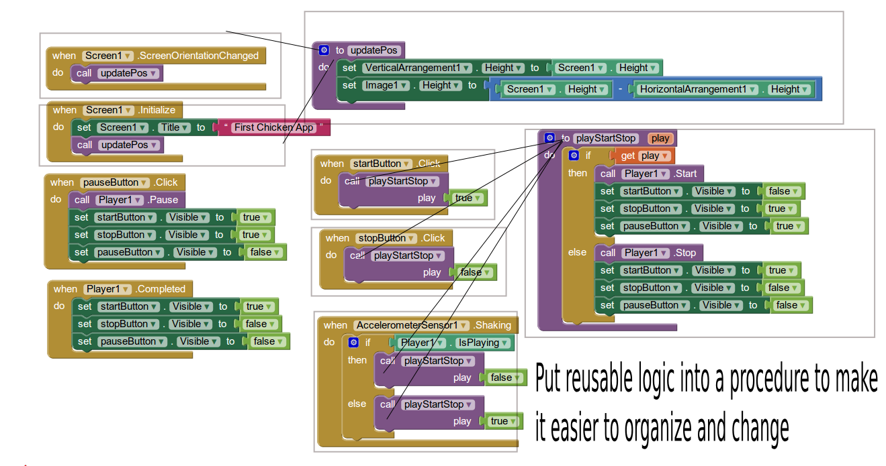

##Review Last week's assignments

Procedures make logic reusable. We can improve the last week's project by using 2 procedures.

##First Assignment: first of a 3 week project

###create a simple game in 3 weeks

1. research and planning
2. making it work
3. finishing it up: make it look good and work perfectly

Here are are ideas:

1. a memory game: place at least 4 pairs of image sprites randomly on the canvas, track the time a player uses to complete a game. display top 5 quickest score at the end of a game
2. a car race game: move an image sprite or the car, a player needs to avoid randomly placed animals on the road, track the time used to reach the finish lime. display top 5 quickest score at the end of a game
3. a rocket launch count down game for kids to learn to count backwards. place 10 number imagesprites on the canvas, a player needs to place the numbers in order. at the end, animate a rocket launch.
4. [more ideas here](http://explore.appinventor.mit.edu/sites/all/files/Resources/Thesis_FINAL_AnshulBhagi.pdf)
5. [Molemash-2](http://appinventor.mit.edu/explore/ai2/molemash-2.html)
6. [check out what other people did](https://sites.google.com/site/appinventorcourse/)
7. [check out some games on appinventor.org](http://www.appinventor.org/shootergame-steps)

###First week: research and planning

1. describe the game of your choice: make sure it's meanful like the first 3 ideas I put out here
2. research what you need to complete your game: components, block logics, variables
3. put together a plan or todo list
4. execute your plan

##Second assignment: work on your google site but do not share publicly.

1. go through the first few chapters of Google Site video tutorial => 1 - Google Sites Essential Training
2. create a google site that you think it's useful to others or yourself. Do not share publicly!
3. you need your parents' permission to share it publicly. You can alway show it to us during gathering.

##Third optional assignment

1. HTML basics video tutorial => 2 - Up and Running with HTML
2. HTML 5 video tutorial => 3 - HTML5 - Structure, Syntax, and Semantics
3. Try to use Sublime Text to create or edit an HTML 5

